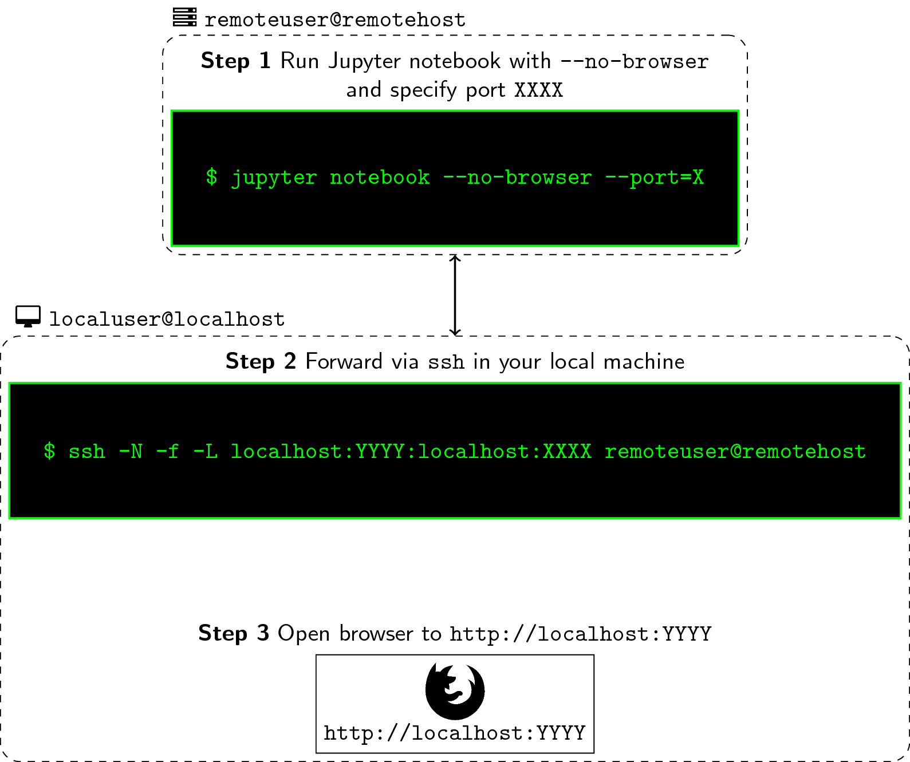

# Phuselab - Perceptual computing and Human Sensing Lab


## Accesso ai server via SSH

Per usare i server `pascal.di.unimi.it`, `tesla.di.unimi.it`, `dalab.di.unimi.it`, `turing.di.unimi.it` o `volta.di.unimi.it` del laboratorio _phuselab_
occorre un account con proprio `username` (in genere il cognome).
L'autenticazione avviene tramite chiave SSH, una gestione delle credenziali di accesso sicuro basata su crittografia a chiave pubblica supportata dal protocollo SSH.

Quindi:

- generare la coppia chiave pubblica-privata dal proprio pc personale utilizzando `ssh-keygen` ([keygen](https://www.ssh.com/ssh/keygen/))
- inviare al docente per email la chiave pubblica come file allegato per avere la propria chiave accreditata sul server
- accedere al server da terminale locale (per es.) a pascal con `ssh username@pascal.di.unimi.it`, oppure a volta con `ssh username@volta.di.unimi.it`
- la propria home avrà global path: `/home/studenti/<cognome>`
- cambiare subito la password temporanea definita per generare l'utente


## Installazione di Conda e Python su Jupyter Notebook

Per definire un ambiente di lavoro privato basato su python, installare Mini-conda dalla propria login:

- seguire le istruzioni su https://docs.conda.io/en/latest/miniconda.html

Pe utilizzare in remoto (via browser) Python su Jupyter Notebook occorre procedere con l'installazione:

- seguire le istruzioni su https://jupyter.org/install

## Uso di Jupiter Notebook da remoto



### __Step 1__: Run Jupyter Notebook from remote machine

- Log-in to your remote machine the usual way you do. In most cases, this is simply done via an ssh command. Once the console shows, type the following:

```bash
remoteuser@remotehost: jupyter notebook --no-browser --port=XXXX
```

- jupyter notebook: simply fires up your notebook
  - --no-browser: this starts the notebook without opening a browser
  - --port=XXXX: this sets the port for starting your notebook where the default is 8888. When it’s occupied, it finds the next available port.

### __Step 2__: Forward port XXXX to YYYY and listen to it

- In your remote, the notebook is now running at the port XXXX that you specified. What you’ll do next is forward this to port YYYY of your machine so that you can listen and run it from your browser. To achieve this, we write the following command:

```bash
localuser@localhost: ssh -N -f -L localhost:YYYY:localhost:XXXX remoteuser@remotehost
```

- ssh: your handy ssh command. See man page for more info
- -N: suppresses the execution of a remote command. Pretty much used in port forwarding.
- -f: this requests the ssh command to go to background before execution.
- -L: this argument requires an input in the form of local_socket:remote_socket. Here, we’re specifying our port as YYYY which will be binded to the port XXXX from your remote connection.

### __Step__ 3: Fire-up Jupyter Notebook

- To open up the Jupyter notebook from your remote machine, simply start your browser and type the following in your address bar:

```bash
localhost:YYYY
```

- Again, the reason why we’re opening it at YYYY and not at XXXX is because the latter is already being forwarded to the former. XXXX and YYYY can be the “same” number (not the same port, technically) because they are from different machines.
- If you’re successful, you should see the typical Jupyter Notebook home screen in the directory where you ran the command in Step 1. At the same time, if you look in your remote terminal, you should see some log actions happening as you perform some tasks.
- In your first connection, you may be prompted to enter an Access Token as typical to most Jupyter notebooks. Normally, I’d just copy-paste it from my terminal, but to make things easier for you, you can set-up your own notebook password.

## Uso di Google Colab e Jupyter notebook

_Google Colab_ è una piattaforma che permette di eseguire codice direttamente sul cloud (macchina virtuale temporanea)
 o in locale su server privato, come i server del laboratorio. Occorre avere un account Google con
 accesso a Google Drive dove salvare i propri notebook. Il grande vantaggio che viene offerto in entrambe le modalità operative, 
 è la disponibilità di una GPU Nvidia utile ad accelerare le computazioni onerose di framework complessi come 
 quelli che implementano modelli basati su deep learning, per es. Pytorch, Tensorflow o Keras.
 
Di seguito i passi per programmare in Python sul server tramite i notebook gestiti in Colab.

- Collegare l'applicazione __Colaboratory__ dal _Google Workspace Marketplace_ (`Nuovo/altra applicazione/Colaboratory`)
- Aprire un nuovo notebook Colab da Drive (`Nuovo/altro/Google Colaboratory`) da browser _Chrome_, _Firefox_, _Safari_
- Dal pulsante _connetti_ scegliere _connetti a runtime locale_ e seguire le istruzioni _Create a local connection by following these instructions_ per installare patch locali che permettono a Colab l'accesso al server da remoto (dal proprio PC)
  - in particolare da STEP 2 installare
    - `pip install jupyter_http_over_ws`
    - `jupyter serverextension enable --py jupyter_http_over_ws`
- Lanciare dal terminate `tmux` per la gestione e il controllo di applicazioni da terminale (continua ad eseguire in background anche dopo logout)
- Lanciare dal server il comando `jupyter notebook --NotebookApp.allow_origin='https://colab.research.google.com' --port=8888 --NotebookApp.port_retries=0`, che attiva il notebook su jupyther
- Lanciare da terminale su PC locale il comando `ssh -N -f -L localhost:8888:localhost:8888 username@volta.di.unimi.it` che attiva il tunnelling verso server remoto
- __NB.__ la porta `8888` è assegnata di default e può essere usata da un solo utente per volta (come tutte le altre porte!)... scegliere quindi una porta > 9000 (a caso e senza che sia già in uso - caso quest'ultimo segnalato dal sistema)

